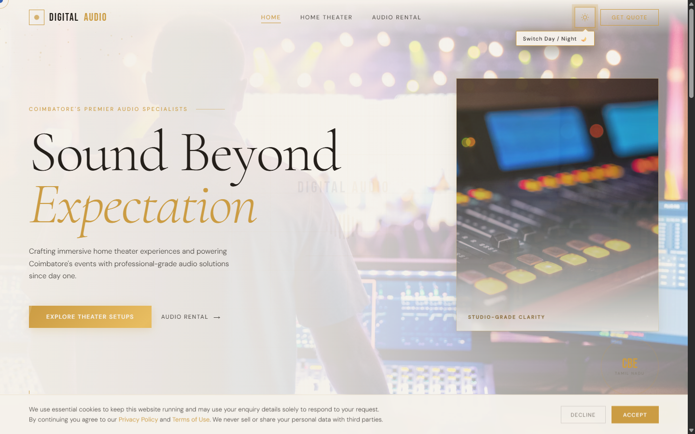

<div align="center">

  <br />

  <!-- Animated Gold Title Banner -->
  <a href="https://github.com/RaghavSdev/DigitalAudio-Website">
    
  </a>

  <p align="center">
    <b>Coimbatore's Premier Home Cinema Engineering & Professional Audio Rental Experience</b>
  </p>

  <!-- Badges -->
  <p align="center">
    
    
    
    
  </p>

  <br />

</div>

---

## 💎 Screenshots

<div align="center">

| 💻 1️⃣ Live Desktop Interface | 📱 2️⃣ Live Mobile Responsive View |
| :---: | :---: |
|  |  |
| *Digital Audio Widescreen Desktop Landing & Navigation* | *Responsive Mobile Touch UI & Layout* |

</div>

---

## ✨ Highlights & Key Features

```
 ┌─────────────────────────────────────────────────────────────────────────┐
 │                                                                         │
 │   ☀️ Day Light & 🌙 Night Cinema Themes  ·  Seamless State Switcher     │
 │   ⚡ Emil Kowalski Motion System        ·  Sub-300ms Snappy Timing      │
 │   🍿 Custom Home Theater Configurator    ·  Dolby Atmos & 4K Vision     │
 │   🔊 Pro Event Audio Rental Fleet        ·  Line Arrays & Live Mixers   │
 │   💬 Instant WhatsApp Booking Engine     ·  Auto-Formatted Quotations   │
 │   ♿ Full Accessibility & Motion Control ·  Prefers-Reduced-Motion      │
 │                                                                         │
 └─────────────────────────────────────────────────────────────────────────┘
```

### 🌟 Key Capabilities

- **☀️ Default Day Light & 🌙 Night Cinema Engine**:
  - Starts in a warm, bright **Day Light Mode** (`#F5F1EB`) with customized image brightness filters and smooth variable transitions.
  - Switches instantly to dark **Night Cinema Mode** (`#060608`) for ambient night browsing.
  - **Post-Loader Theme Suggestion**: Gently pulses a golden halo glow and displays a floating hint badge (`"Switch Day / Night 🌙"`) right after initial loading to guide visitors.

- **⚡ Emil Kowalski Motion Design System**:
  - Built strictly on custom high-craft cubic-beziers: `--ease-out-strong: cubic-bezier(0.23, 1, 0.32, 1)` and `--ease-in-out-strong: cubic-bezier(0.77, 0, 0.175, 1)`.
  - **Sub-300ms Interactions**: Snappy 0.2s link hovers, 0.4s page transitions, and 0.55s scroll reveals with subtle 24px vertical offsets.
  - **GPU-Accelerated Scroll Bar**: Progress bar utilizes `transform: scaleX()` with `transform-origin: left` for zero layout thrashing.
  - **Tactile Click Feedback**: Integrated `:active` scale shifts (`scale(0.97)`) on all interactive buttons and cards.

- **🍿 Home Cinema & Pro Audio Solutions**:
  - Dedicated pages for **Home Theater Setups** (4K Laser Projection, Acoustic Panel Tuning, Dolby Atmos Calibration) and **Audio Rental** (Weddings, Concerts, Corporate Expos, DJ setups).
  - Interactive multi-page routing without page reloads.
  - Automatic return to top-of-home on browser refresh.

- **💬 Instant WhatsApp Integration**:
  - One-click smart messaging pre-configured for quotes, theater queries, and rental availability.
  - Automatically formats and appends enquiry details from booking forms directly into WhatsApp chats.

---

## 🛠️ Technology Stack

<div align="center">

| Component | Technology | Purpose |
| :--- | :--- | :--- |
| **Markup** | HTML5 Semantic Elements | Accessible structure, SEO optimization, and screen-reader support |
| **Styling** | Vanilla CSS3 (Custom Variables) | Design token system, glassmorphism (`backdrop-filter`), and layout |
| **Animation** | CSS Keyframes & Cubic Beziers | Custom Emil Kowalski motion curves, hardware-accelerated transforms |
| **Scripting** | Vanilla JavaScript (ES6+) | Single-page router, intersection observers, particle canvas, theme manager |
| **Typography** | Cormorant Garamond & DM Sans | Luxury serif headlines paired with clean UI typography |

</div>

---

## 📁 Repository Structure

```text
DigitalAudio-Website/
├── 📄 index.html           # Core application (HTML, CSS Design Tokens, JS Engine)
├── 🖼️ receiver_main.png    # High-resolution AV receiver & speaker main display photo
├── 🖼️ speaker_inset.png    # Precision gold speaker driver detail inset photo
├── 📄 README.md            # Repository documentation
└── 📄 task.md              # Feature checklist and verification plan
```

---

## 🚀 Quick Start & Running Locally

Since the project uses zero third-party framework dependencies, you can open and run it immediately in any web browser.

### Option 1: Using Python HTTP Server (Recommended)

```bash
# Clone the repository
git clone https://github.com/RaghavSdev/DigitalAudio-Website.git

# Navigate into the project folder
cd DigitalAudio-Website

# Start a local web server
python -m http.server 8000
```
Then open **`http://localhost:8000`** in your browser.

### Option 2: Using Node.js Serve

```bash
npx serve ./ -p 8000
```

### Option 3: Direct File View

Simply double-click or drag **`index.html`** into Google Chrome, Safari, or Microsoft Edge.

---

## 🎨 Motion Design Architecture

The motion design system follows **Emil Kowalski's Design Engineer Principles**:

```css
:root {
  /* Emil Kowalski Recommended Curves */
  --ease-out-strong:     cubic-bezier(0.23, 1, 0.32, 1);   /* Snappy entrance */
  --ease-in-out-strong: cubic-bezier(0.77, 0, 0.175, 1);  /* Smooth theme switch */
  --ease-micro:          cubic-bezier(0.25, 0.46, 0.45, 0.94); /* Sub-200ms link hovers */
}

/* GPU Composited Progress Bar */
#da-progress {
  transform: scaleX(0);
  transform-origin: left;
  transition: transform 0.08s linear;
}

/* Tactile Active Feedback */
.btn-gold:active, .nav-cta:active {
  transform: translateY(0) scale(0.97);
  transition-duration: 0.1s;
}
```

---

## 📞 Contact & Business Details

**Digital Audio — Coimbatore**  
📍 *Coimbatore, Tamil Nadu, India*  
📞 **Phone / WhatsApp**: [+91 9442538840](https://wa.me/919442538840)  
📧 **Email**: [info@digitalaudiocbe.com](mailto:info@digitalaudiocbe.com)  

---

<div align="center">

  <p>Crafted with Precision for <b>Digital Audio Coimbatore</b></p>
  <p>© 2025 Digital Audio. All rights reserved.</p>

</div>
