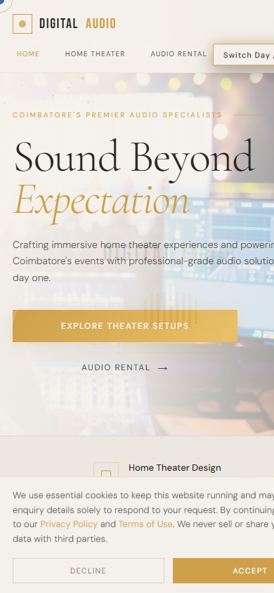

# DigitalAudio Website

A premium, responsive website for **Digital Audio**, an audio solutions business based in Coimbatore. The site presents home theater installations, professional audio rental, acoustic consultation, event sound support, and quick contact options in a polished black-and-gold visual style.

## Screenshots

### Desktop View


### Mobile View



## About the Website

This website is designed as a modern business landing page for a professional audio service provider. It introduces Digital Audio as a Coimbatore-based specialist for immersive sound experiences, with clear navigation for customers interested in home theater setups or event audio rental.

The homepage highlights the brand message, key services, business credibility, and contact details. Separate sections cover home theater packages, installation process, authorized partners, audio rental use cases, equipment fleet, and booking enquiries.

## Features

- Responsive design for desktop, tablet, and mobile screens
- Elegant dark theme with gold accents
- Home, Home Theater, and Audio Rental page sections
- Service cards for theater setup, rental, and acoustic consultation
- Event audio coverage for weddings, corporate events, concerts, schools, religious events, and outdoor programs
- WhatsApp and phone contact actions
- Smooth scrolling and interactive page switching
- Single-file HTML, CSS, and JavaScript implementation

## Tech Stack

- HTML5
- CSS3
- JavaScript
- Google Fonts

## Project Structure

```text
.
+-- README.md
+-- digital-audio-website.html
+-- assets
    +-- screenshot.png
    +-- screenshot-mobile.png
```

## How to View

Open `digital-audio-website.html` directly in your browser.

You can also host this project with GitHub Pages by uploading the repository and enabling Pages from the repository settings.
